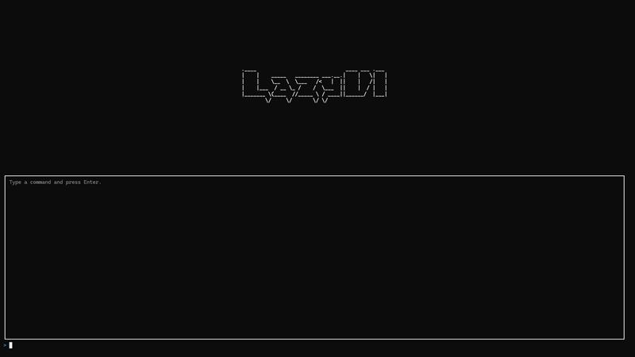

# LazyUI
## A simple Spectre.Console GUI Extension

It uses the Spectre.Console ecosystem to build a live gui context for console applications.
Currently  there is only one type of Layout supported:

### LazyLayout

	+-------------------------------+
	|								|
	|			Content				|
	|								|
	+-------------------------------+
	+-------------------------------+
	|								|
	|			Output				|
	|								|
	+-------------------------------+
	> Input

It uses a ContentPanel which can be populated by any IRenderable and sticks to on top.
A hideable OutputPanel which displays dispatched cli commands and their output.
A InputPanel which dispatches cli commands and implements basic hotkey and selection functionality.

### How does it work?

It uses a simple Spectre.Console CommandApp that hosts the GuiContext and a GUI driven CommandApp which 
loads the GuiContext lazily from the host app. 

It was implemented this way to give the user the option to use the functionality of the app even without using the GUI.

### Via modern Dependency Injection Container

        public static async Task Main(string[] args)
        {
            var app = CreateGuiCommandApp();

            await app.RunAsync(args);
        }

		public CommandApp CreateGuiCommandApp()
        {
            var services = new ServiceCollection();

            services.AddSingleton<GuiContext>();
            services.AddSingleton<GuiCommandDispatcher>(sp =>
            {
                var innerServices = new ServiceCollection();
                var capturingConsole = new CapturingConsole();

                // Configure services here

                innerServices.AddSingleton<IAnsiConsole>(capturingConsole);

                // Load GuiContext lazily in inner application
                innerServices.AddSingleton(_ => sp.GetRequiredService<GuiContext>());

                var innerApp = new CommandApp(new TypeRegistrar(innerServices));
                innerApp.Configure(config =>
                {
                    config.Settings.Console = capturingConsole;

                    // Configure your GUI commands here
                });

                return new GuiCommandDispatcher(innerApp, capturingConsole);
            });

            var app = new CommandApp(new TypeRegistrar(services));
            app.Configure(config =>
            {
                config.AddCommand<GuiCommand>("gui");
            });

            return app;
        }

### TODO
- Create GuiSettingsCommand and GuiSettingsPanel
	- Color Palette, Start Settings, Keybinds
- Create Input History > InputPanel
